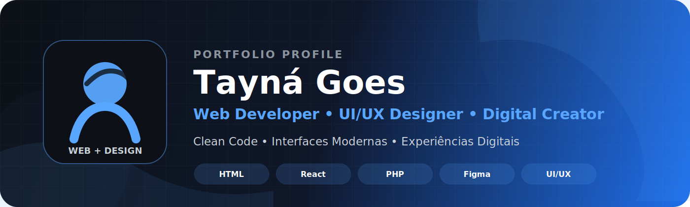

 

  

---

## 👋 Olá!

Sou **Tayná Goes**, **Desenvolvedora Web** e **Designer Digital**.

Desde **2021**, trabalho desenvolvendo aplicações web, interfaces modernas e experiências digitais completas. Minha maior paixão é unir **desenvolvimento** e **design**, criando produtos que não apenas funcionam bem, mas que também proporcionam uma experiência intuitiva, acessível e memorável para quem utiliza.

Atualmente atuo com desenvolvimento de sistemas web, landing pages, interfaces UI/UX, produtos digitais, aplicações responsivas, identidade visual, artes para redes sociais e soluções focadas em performance.

---

## 🚀 Especialidades

<table>
  <tr>
    <td width="50%" valign="top">
      <h3 align="center">👩🏻‍💻 Desenvolvimento</h3>
      <ul>
        <li>HTML5, CSS3, SCSS</li>
        <li>JavaScript e TypeScript</li>
        <li>React</li>
        <li>PHP e Node.js</li>
        <li>Bootstrap e Tailwind CSS</li>
        <li>SQL e APIs REST</li>
        <li>Git e GitHub</li>
        <li>Clean Code e Componentização</li>
      </ul>
    </td>
    <td width="50%" valign="top">
      <h3 align="center">🎨 Design</h3>
      <ul>
        <li>UI Design e UX Design</li>
        <li>Design Systems</li>
        <li>Identidade Visual</li>
        <li>Social Media</li>
        <li>Photoshop e Illustrator</li>
        <li>Figma</li>
        <li>CorelDRAW e Canva</li>
        <li>Produtos Digitais</li>
      </ul>
    </td>
  </tr>
</table>

---

## 💻 Tech Stack

### Front-end

### Back-end

### Design

  

### Ferramentas

---

## 🧩 O que eu entrego

| Área | Entrega |
|---|---|
| 💻 Desenvolvimento Web | Sites, sistemas, landing pages e aplicações responsivas |
| 🎨 UI/UX Design | Interfaces modernas, intuitivas e bem estruturadas |
| 🖌️ Design Digital | Identidade visual, social media e materiais digitais |
| ⚡ Performance | Páginas otimizadas, organizadas e funcionais |
| 🧠 Experiência do Usuário | Soluções pensadas para clareza, usabilidade e acessibilidade |

---

## 🌎 Onde me encontrar

  

---

## 📊 GitHub Analytics

 

 

---

## 🏆 GitHub Trophies

---

## 🐍 Snake Contribution

---

## 🚀 Atualmente

- 💻 Desenvolvendo sistemas web e interfaces responsivas
- 🎨 Criando interfaces modernas e materiais digitais
- ⚡ Aprimorando conhecimentos em novas tecnologias
- 🌱 Evoluindo continuamente como desenvolvedora e designer
- 🧩 Unindo código, criatividade e experiência do usuário

---

## 💡 Filosofia

> **"Código limpo resolve problemas. Design inteligente cria experiências. A combinação dos dois constrói produtos memoráveis."**

---

---

  

  

<strong>Desenvolvimento • Design • Criatividade • Tecnologia</strong>

  

Feito com 💙 por <strong>Tayná Goes</strong>

 

